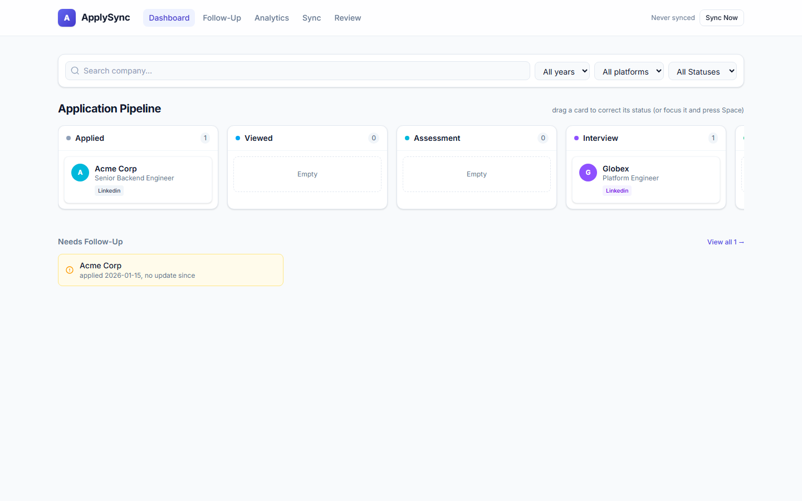
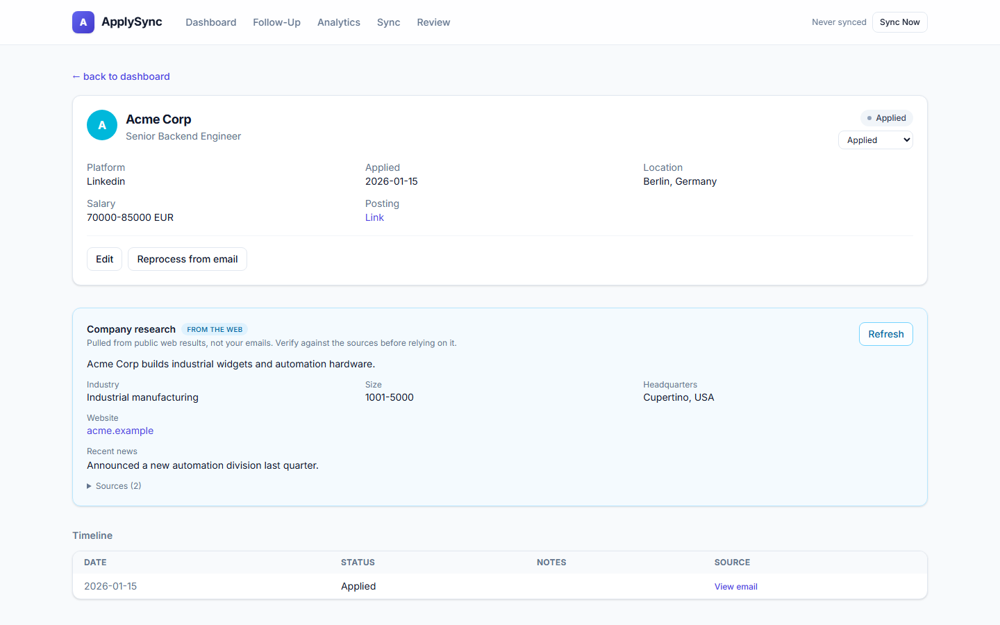
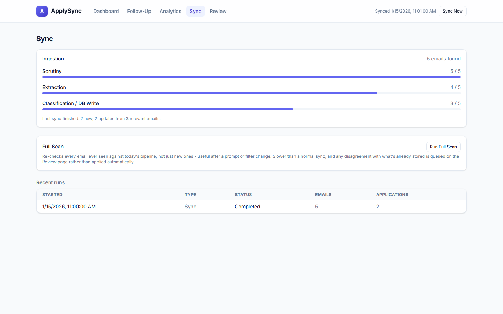
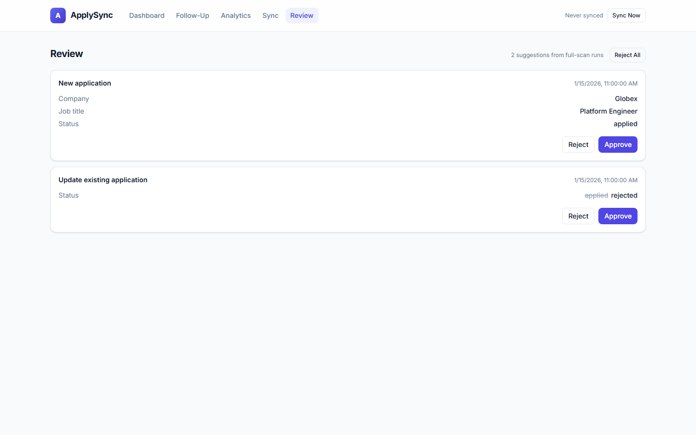
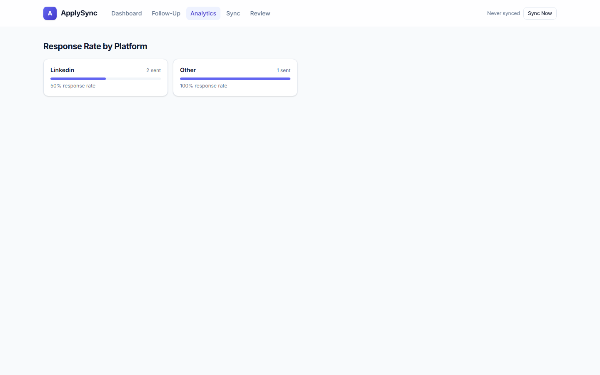
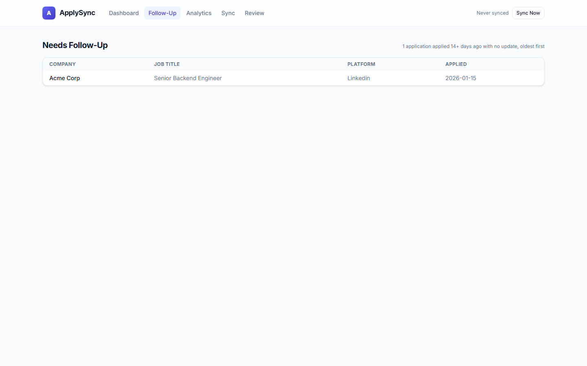

# ApplySync

An email-driven job application tracker that pulls your applications out of your inbox and into one place, no matter which platform or company you applied through.

## Table of Contents

- [Motivation](#motivation)
- [Tech Stack](#tech-stack)
- [Features](#features)
- [Screenshots](#screenshots)
- [Architecture](#architecture)
- [LangGraph Decision Making](#langgraph-decision-making)
- [Data Flow](#data-flow)
- [Setup](#setup)
- [LLMOps](#llmops)
- [Local Model Experiment](#local-model-experiment-8gb-vram)
- [Roadmap](#roadmap)
- [Contributing](#contributing)
- [License](#license)
- [Acknowledgments](#acknowledgments)

## Motivation

Job hunting across LinkedIn, Indeed, StepStone, direct company career pages, and whatever new AI recruiting tool shows up this month means your application history ends up scattered across a dozen inboxes and a pile of manually named folders. There is no single place that answers a simple question: which companies have I actually applied to, and what happened next? ApplySync starts from an observation: almost every application you submit generates a confirmation or status email somewhere, whether from LinkedIn, an ATS vendor like SmartRecruiters or Personio, or the company itself. Instead of building a scraper for every platform (a losing battle the moment any of them changes their HTML), ApplySync reads those emails directly and uses an LLM to pull out the structured facts: company, role, status, platform. New platforms and ATS vendors need a config change, not new code. On top of that extraction pipeline, ApplySync layers self-hosted, keyless web-research capabilities (company research, follow-up drafting, entity resolution) that turn it from a passive inbox reader into an active research assistant for your job search. The author uses it every day to track a real one.

## Tech Stack

- **Language**: Python 3.11+
- **LLM orchestration**: [LangChain](https://www.langchain.com/) and [LangGraph](https://www.langchain.com/langgraph) - structured-output extraction, a stateful per-email graph with conditional routing, SQLite checkpointing, and a hand-rolled tool-calling agent loop for entity/duplicate resolution
- **LLM provider**: [NVIDIA NIM](https://build.nvidia.com/) via `langchain-nvidia-ai-endpoints`, a fast model (`nvidia/nemotron-3-nano-30b-a3b`, reasoning disabled for speed) for the vast majority of calls, tiered up to a larger escalation model for rare ambiguous cases and the low-volume disambiguation agent, all sharing one process-wide client-side rate limiter matched to the free tier's 40 requests/minute cap. The disambiguation agent can optionally be pointed at [Groq](https://groq.com/) via `langchain-groq` (its own account and rate budget, much lower latency) with automatic fallback to the NVIDIA escalation model, so the agent's multi-turn tool loop stops competing with bulk extraction for one shared budget
- **Email ingestion**: Gmail API (readonly scope only) via `google-api-python-client`, concurrent per-message fetch via a thread pool
- **Persistence**: SQLite via [SQLModel](https://sqlmodel.tiangolo.com/); fuzzy company-name matching via [rapidfuzz](https://github.com/rapidfuzz/RapidFuzz)
- **API**: [FastAPI](https://fastapi.tiangolo.com/), explicit Pydantic response models (real, useful `/docs` Swagger UI)
- **Frontend**: React (Vite + TypeScript) + Tailwind + Framer Motion + `@dnd-kit`, a separate dev server calling the FastAPI JSON API
- **Scheduler**: none yet in-process - see [Roadmap](#roadmap)
- **Observability**: self-hosted [Langfuse](https://langfuse.com/) (Postgres/ClickHouse/Redis/MinIO via docker-compose, NOT a hosted SaaS - email content never leaves the machine) traces every pipeline node and agent tool loop; a hand-labeled eval harness with per-stage accuracy metrics gates prompt/model changes before they ship

## Features

What is actually working today:

- **Gmail ingestion** with a readonly OAuth flow (never write or send scopes), either via the CLI's first-run consent or a "Connect Gmail" button in the dashboard that walks through Google's consent screen and back
- **Platform-agnostic, keyword-driven search**: application-related emails are found by subject phrase and keyword (`backend/config/sources.yaml`'s `confirmation_keywords`), not a hardcoded sender allowlist, so ATS vendors and direct company emails that were never explicitly added still get picked up
- **Concurrent Gmail fetch**: per-message bodies are fetched with a worker thread pool rather than one at a time
- **A LangGraph extraction pipeline**, one email per graph invocation:
  - `scrutinize_relevance`: a hybrid heuristic + cheap-LLM filter that rejects job-alert digests and recommendation emails before they ever reach the expensive extraction call, escalating to a larger model only for the rare genuinely ambiguous subject
  - `classify_and_extract`: one merged LLM call classifies relevance and extracts structured fields (company, job title, status, location, salary, URL), with one escalation-model retry if the fast call fails outright or returns no usable company name
  - `match_existing_application`: heuristic company/title/platform matching decides new vs. update vs. duplicate - normalized for case, whitespace, legal suffixes ("SE"/"GmbH"/"Inc"), and gender/diversity qualifiers ("(m/f/d)"), plus **fuzzy company-name matching** (typo and word-add tolerant, e.g. "EGYM" vs "EGYM SE" vs a one-character typo) that always routes through the disambiguation agent rather than auto-merging
  - `disambiguate_match`: a hand-rolled LLM tool-calling agent (not a fixed graph node) for the genuinely ambiguous case - same company, no exact title match. It inspects a candidate's status history and source email, can check the company's real-world identity via web search, and must gather actual evidence before it's allowed to submit a merge verdict (a same-application/duplicate decision is rejected outright if the agent never looked at that candidate first) - fails open to a new (recoverable) row rather than ever risking a silent wrong merge. Date comparisons between candidate emails are computed in Python and handed to the model as an explicit annotation ("5 days AFTER the new email"), not left to the model's own arithmetic - an LLM-as-judge audit found this was the single largest source of real disambiguation errors. Similarly, when the new email and exactly one candidate share an ATS requisition ID, that same-posting case is resolved deterministically in Python before the model runs at all. The agent optionally runs on Groq with automatic fallback to NVIDIA, keeping its slow multi-turn tool loop off NVIDIA's shared extraction rate budget
  - `upsert_db`: deterministic persistence, no LLM involved
- **Idempotent processing**: every email is tracked by Gmail message id so re-runs never reprocess or duplicate the same email; a run's incremental progress (emails scrutinized/extracted/written) is persisted as it happens, not just once the run finishes
- **Status tracking across the full application lifecycle**: applied, viewed, assessment, interview, rejected, offer, declined (manual-only, for offers you turn down yourself), and other
- **A React dashboard**: a status-board (Kanban) view with drag-and-drop status correction (keyboard-operable via `@dnd-kit`), inline field editing, a "reprocess from source email" action, per-application timelines with the original source email viewable inline, follow-up reminders, and a per-platform response-rate breakdown - all served by a FastAPI JSON API with a full OpenAPI schema
- **Manual "Sync Now"** button and a dedicated `/sync` page with a staged progress view (ingestion/scrutiny/extraction/write), a live pipeline-flow graph that mirrors the actual LangGraph structure and animates node-by-node as a real sync runs (SSE-driven, diagnostic only), a Stop button for cancelling an in-progress run, and recent-run history, plus the equivalent `applysync sync` CLI command
- **Full Audit**: re-runs today's extraction logic against every email ever seen (not just new ones) to catch drift from a prompt/model change; never writes directly, every disagreement becomes a reviewable suggestion on the `/review` page
- **Best-effort platform attribution** for dashboard labeling (LinkedIn, Indeed, StepStone, SmartRecruiters, Personio, Ashby, and more), configured entirely in `backend/config/sources.yaml`
- **Company research card**: an on-demand "research this company" action on the detail page that pulls a grounded profile (summary, industry, size, HQ, website, recent news) from live web results via the self-hosted SearXNG layer. Web-sourced and clearly labeled as such, kept strictly separate from email-extracted data, with source links for verification and a cached-and-shared profile per company
- **Reliability tooling** (see `CLAUDE.md`'s M5 milestone for full detail): a hand-labeled eval harness (real emails, human-verified labels, per-stage accuracy metrics - scrutiny false-reject rate, classification accuracy, per-field extraction accuracy) that gates prompt/model changes before they ship, plus self-hosted Langfuse tracing every node and agent tool loop of a real sync for after-the-fact debugging, with a flagged-trace-to-eval-sample feedback loop
- **Playwright end-to-end tests** with an `@axe-core/playwright` accessibility check on every page

Not built yet, see [Roadmap](#roadmap): automatic/scheduled syncing and confidence-routed merge review.

## Screenshots

Rendered from the Playwright end-to-end suite's mocked fixtures, so they use
example data ("Acme Corp", "Globex"), not a real inbox. Regenerate with
`SCREENSHOTS=1 npx playwright test screenshots.spec.ts` in `frontend/`.

**Application pipeline** - a Kanban board grouped by status, with drag-and-drop status correction and a follow-up reminders preview:



**Application detail with company research** - the web-research card is clearly labeled as web-sourced and kept separate from the email-extracted fields above it, with source links for verification:



**Sync** - a live pipeline-flow graph animated node-by-node as the run progresses, a staged progress view (ingestion, scrutiny, extraction, classification/DB write), a Stop button, a recent-run history, and the Full Audit control:



**Review** - Full Audit runs never overwrite data; they queue suggestions here for approval, with a before/after diff for status changes:



**Analytics** - response rate per platform:



**Follow-Up** - applications with no update in 14+ days, oldest first:



## Architecture

```
[Gmail API] --(poll, keyword-filtered query, concurrent fetch)--> gmail/client.py
                                                                          |
                                                                raw email batch
                                                                          v
                                    LangGraph pipeline: pipeline/graph.py (one email per invocation)
   scrutinize_relevance -> classify_and_extract -> match_existing_application -+-> upsert_db
        (heuristic + cheap/escalation LLM)  (merged classify+extract,           |     ^
                                             + escalation retry)     ambiguous: |     |
                                                                                v     |
                                                              disambiguate_match ------
                                                              (LLM tool-calling agent:
                                                               status history, source
                                                               email, web identity check)
                                                                          |
                                                                          v
                                                    SQLite: db/models.py + repository.py
                                                                          |
                                                                          v
                                                     FastAPI JSON API (web/api.py, /api/*)
                                                                          |
                                                                          v
                                                    React frontend (frontend/, separate dev server)

              Manual trigger: POST /api/sync -> background thread runs the pipeline once
              [Not yet built] Scheduler: an OS-level scheduled task -> `applysync sync` daily
              Self-hosted Langfuse (langfuse/, docker-compose) traces every node and
              agent tool loop of a sync; diagnostic only, never load-bearing
```

`fetch_emails` is a plain batch fetch, not a graph node - the graph operates on one email at a time, driven by a loop in `process_emails`. An email that fails scrutiny, isn't a genuine application confirmation, or can't be confidently extracted is routed to a short-circuit terminal node that marks it processed without creating any application/event rows, so it is recorded once and never retried, while the reason it was skipped is kept.

## LangGraph Decision Making

The Architecture diagram above shows the happy path. This section shows the actual branching logic inside the compiled `StateGraph` (`pipeline/graph.py`) - every conditional edge, the exact field it checks, and where each branch terminates:

```
+------------------------------+
|     scrutinize_relevance     |   entry point - heuristic string match;
+------------------------------+   LLM call only if ambiguous (fails open to "pass")
              |
              |---- scrutiny == "reject" ----> +------------------------+
              |                                | mark_scrutiny_rejected |  --> END
              |                                +------------------------+
              v   scrutiny == "pass"
+------------------------------+
|     classify_and_extract     |   always 1 LLM call (ClassifyAndExtractResult)
+------------------------------+
              |
              |---- extracted is None, classification == "irrelevant" ------> +-----------------+
              |                                                               | mark_irrelevant |  --> END
              |                                                               +-----------------+
              |
              |---- extracted is None, else (LLM error / missing fields) ---> +------------------------+
              |                                                               | mark_extraction_failed |  --> END
              |                                                               +------------------------+
              v   extracted is not None
+------------------------------+
|  match_existing_application  |   DB heuristic match (company+title+platform,
+------------------------------+   with fuzzy company matching), no LLM
              |
              |---- match is None, candidate_ids set, agent available -----> +--------------------+
              |     (ambiguous: same company - exact or fuzzy - no            | disambiguate_match |
              |      exact title match)                                      +--------------------+
              |                                                                        |
              v   match is not None (resolved: exact company+title,                    |
              |   or no agent/candidates: clear new_application)                       |
+------------------------------+                                                       |
|          upsert_db           |  <------------------------------------------------------
+------------------------------+   deterministic: insert new Application or append StatusEvent
              |
              v
             END
```

What each conditional edge actually checks:

- **`scrutinize_relevance` -> `scrutiny`** (`"pass"` / `"reject"`): a pure heuristic (subject/body string matching against known digest markers and confirmation phrases) resolves most emails with zero LLM calls; only a genuinely ambiguous subject triggers one `RelevanceOnlyResult` LLM call, escalated to the larger model.
- **`classify_and_extract` -> `_route()`** on `extracted` and `classification`: `extracted is not None` routes to matching; `extracted is None` splits again on whether the model classified the email as `"irrelevant"` versus a genuine failure (LLM error, or missing `company_name` - the latter gets one escalation-model retry before failing).
- **`match_existing_application` -> `_route_match()`** on `match`/`candidate_ids`: an exact company+title hit resolves immediately (`match` set, straight to `upsert_db`); no company match at all is a clear `new_application`; a company match (exact *or* fuzzy) with no exact title match leaves `match` unset and `candidate_ids` populated, routing to `disambiguate_match` when the agent's dependencies (`gmail_client`/`search_client`) are wired in, or falling open to `new_application` when they aren't (unit tests, a degraded run).

All three `mark_*` nodes (`mark_scrutiny_rejected`, `mark_irrelevant`, `mark_extraction_failed`) are the same `make_skip_node` factory, parameterized only by the `classification` string they record - each just calls `repo.mark_processed` and writes no `Application`/`StatusEvent` rows, so a skipped email is recorded once and never retried, while the reason it was skipped is preserved for later inspection.

`match_existing_application`'s `MatchDecision.action` (`new_application` vs. `update_existing` vs. `duplicate_skip`) branches *inside* `upsert_db` rather than as a graph-level conditional edge - deciding whether to insert a new `Application`, append a `StatusEvent` to an existing one, or write nothing, but not changing which node runs next.

`full_audit.py` (used by the dashboard's "Full Audit" review flow, renamed from `full_scan.py` since it never writes directly - see the Roadmap) reuses `scrutinize_relevance` and `classify_and_extract` as plain Python functions with its own manual branching to produce `ReviewSuggestion` rows for human approval - it does not build or run a `StateGraph`, so it isn't part of this diagram.

### Mostly a workflow, with one narrow agentic exception

Every *graph-level* branch above is a plain Python conditional reading a state field (`scrutiny`, or `_route()`/`_route_match()` on `extracted`/`classification`/`match`) - no LLM decides which node runs next, and the routing itself is deterministic code. That is a deliberate fit for the well-known outcomes (relevant/irrelevant, new/update/duplicate), where a fixed graph is easier to test and reason about than an agent would be.

The one deliberate exception is `disambiguate_match`: for the genuinely ambiguous case (same company, no exact title match), an LLM tool-calling agent - not a fixed sequence of steps - chooses which evidence to gather (status history, source email, a web identity check) and loops until it's ready to submit a verdict. This is a narrow, contained use of agentic behavior exactly where the outcome genuinely can't be predicted in advance, with a hard safety rail: a merge verdict is rejected outright unless the agent actually gathered evidence for that specific candidate first, and any agent failure fails open to a new (recoverable) row rather than a silent wrong merge. The company research card (and further research features on the [Roadmap](#roadmap)) are the other place this project uses genuinely agentic, tool-choosing behavior, outside the graph entirely.

## Data Flow

Following one email through the system, function by function:

1. `run_sync` (`pipeline/graph.py`) builds a Gmail search query from `backend/config/sources.yaml`'s keywords, bounded by the last successful run's date (with a small lookback buffer), and calls `GmailClient.fetch_messages` (`gmail/client.py`) to pull the raw batch concurrently.
2. `process_emails` filters out anything already in the `processed_emails` table (the idempotency guard), then invokes the compiled LangGraph once per remaining email via `compiled.stream(...)`.
3. `scrutinize_relevance` (`pipeline/nodes.py`) runs a heuristic first (instant reject on known digest markers, instant pass on the original narrow confirmation phrases); only a genuinely ambiguous email triggers one cheap `RelevanceOnlyResult` LLM call. A reject routes straight to `mark_scrutiny_rejected` and the email is marked processed without further work.
4. `classify_and_extract` sends the email through one structured-output LLM call (`ClassifyAndExtractResult`) that both classifies relevance and extracts `company_name`, `job_title`, `status`, `job_url`, `location`, and `salary_text` in a single round trip.
5. `match_existing_application` normalizes company name and job title (case, whitespace, legal suffixes, gender qualifiers) and looks for an existing `Application` row with the same company/title/platform - an exact company+title hit resolves immediately (`update_existing`); no company match at all is `new_application`; a company match (exact or fuzzy) with no exact title match is the ambiguous case.
6. For the ambiguous case, `disambiguate_match` (`research/disambiguate.py`) runs an LLM tool-calling loop over the candidate application(s): it can pull each candidate's status history, read the source email it came from, or check the company's real-world identity via web search, before submitting a `same_application`/`different_application`/`duplicate` verdict - a merge verdict is rejected if the agent never actually looked at that specific candidate first. Any agent error, or a missing `gmail_client`/`search_client` dependency, falls open to `new_application`.
7. `upsert_db` writes the `Application` row (if new) or a new `StatusEvent` (if updating), always finishing by calling `mark_processed` so the email is never re-ingested.
8. The FastAPI layer (`web/api.py`) exposes the result as `/api/dashboard`, `/api/applications/{id}`, `/api/reminders`, etc.; the React dashboard (`frontend/`) renders the status board, timeline, and reminders from those endpoints, and can trigger corrections (drag-and-drop status change, inline edit, reprocess-from-source-email) that write back through the same API.

## Setup

### Prerequisites

- Python 3.11 or newer, and Node.js (for the frontend) if you want the dashboard UI
- A Gmail account you apply for jobs from
- A Google Cloud project with the Gmail API enabled and OAuth credentials
- A free [NVIDIA API key](https://build.nvidia.com/) for the LLM calls
- (Optional) Docker, only if you want the self-hosted web-search layer (see [Web search](#web-search-optional) below) powering the research features, and/or self-hosted [observability](#observability-optional) tracing

### Installation

Clone the repository:

```
git clone https://github.com/hanzala-bhutto/ApplySync.git
cd ApplySync
```

Create a virtual environment and install the backend:

```
python -m venv .venv
.venv\Scripts\activate      # Windows
source .venv/bin/activate   # macOS / Linux
pip install -e ".[dev]"
```

Copy the environment template and fill it in:

```
cp .env.example .env
```

At minimum, set `NVIDIA_API_KEY` in `.env`. Optionally, set both `GROQ_API_KEY` and `GROQ_AGENT_MODEL` to run the disambiguation agent on Groq (with automatic NVIDIA fallback); leave them blank and the agent runs on the NVIDIA escalation model exactly as before.

Complete the one-time Gmail OAuth setup (Google Cloud project, consent screen, `credentials.json`) using the walkthrough in `.claude/skills/gmail-setup/SKILL.md`, then place `credentials.json` at the path `.env` points to - or skip this entirely and use the dashboard's "Connect Gmail" button instead, which walks through the same consent flow in the browser.

If you want the dashboard UI, install the frontend separately:

```
cd frontend
npm install
```

### Web search (optional)

The company-research features (research card, follow-up drafting, entity resolution, and more - see [Roadmap](#roadmap)) get live web results from a self-hosted [SearXNG](https://github.com/searxng/searxng) instance. It is deliberately self-hosted and keyless: no external account, no paid API, no third party seeing your queries, matching this project's local-first design. Everything else works without it; only the research features need it.

Start it in its own terminal (Docker must be running):

```
cd searxng
docker compose up -d
```

That brings up SearXNG on `http://localhost:8888` (the default `SEARXNG_URL` in `.env`). Verify it end to end:

```
applysync search "egym careers"
```

The bundled `searxng/settings.yml` enables SearXNG's JSON API and disables the bot-detection limiter (so no Redis sidecar is needed) - both required for programmatic access from a single-user local tool. It ships with a generated `secret_key`; that key only signs this local instance's own sessions and is not a credential to anything external, but you can regenerate it (the file says how) if you prefer.

### Observability (optional)

Per-node, per-call tracing of a real sync - every LangGraph node, every LLM call, and the disambiguation agent's whole tool loop - runs on self-hosted [Langfuse](https://langfuse.com/) (Postgres, ClickHouse, Redis, MinIO via docker-compose), not a hosted SaaS: email content never leaves the machine. Everything else works without it; a sync just runs untraced.

Start it in its own terminal (Docker must be running):

```
cd langfuse
docker compose up -d
```

First run: open `http://localhost:3000`, sign up (a local-only account), create a project, and put its API keys into the project's root `.env` (`LANGFUSE_PUBLIC_KEY`/`LANGFUSE_SECRET_KEY`/`LANGFUSE_HOST`) - see `langfuse/.env.example` for what else to generate. Once set, `applysync sync` traces automatically; tracing is diagnostic only; a missing/misconfigured Langfuse instance never blocks or changes a sync's behavior.

### Usage

Run one pass of the ingestion and extraction pipeline from the CLI:

```
applysync sync
```

Or run the API server and trigger syncs from the dashboard's "Sync Now" button / `/sync` page instead:

```
applysync serve
```

Run the frontend in its own terminal (separate dev server, by design):

```
cd frontend
npm run dev
```

Both `applysync sync` and a dashboard-triggered sync fetch new application-related emails from Gmail, run them through the LangGraph pipeline, and persist the results to a local SQLite database (`applysync.db` by default).

## LLMOps

A prompt or model change is a production deploy: the output is probabilistic, correctness is a percentage rather than a boolean, and the model is a third-party dependency that can drift under you. This project treats that seriously, but stays zero-vendor and zero-egress: everything runs self-hosted, and no email content, database, or gold dataset ever leaves the machine.

Because the gold eval dataset holds real email bodies (PII, gitignored) and the eval hits the live rate-limited model, the checks split across **two planes**:

| Check | Runs where | Touches PII / live model? | How to run |
| --- | --- | --- | --- |
| Unit tests, lint, frontend build + Playwright E2E | GitHub Actions (cloud) | No (LLM mocked, `/api/*` mocked) | automatic on every PR (`.github/workflows/ci.yml`) |
| Prompt/schema-drift guard (locks the classifier's status space) | GitHub Actions (cloud) | No | `pytest tests/test_schema_drift.py` |
| Eval gate (per-stage accuracy vs thresholds) | Local | Yes | `python eval/run_eval.py --strict` |
| Pre-push enforcement of the eval gate | Local git hook | Yes | `sh scripts/install-hooks.sh` (once), then blocks any push that changes prompts/model/schema and regresses; bypass with `git push --no-verify` |
| Quality-over-time ledger | Local, committed | No (aggregate numbers only) | `python eval/run_eval.py --strict --ledger` appends to `eval/baseline.json` |
| Production feedback loop (score traces, pull failures into gold) | Local + self-hosted Langfuse | Yes | `backend/scripts/run_llm_judge_backfill.py`, `backend/scripts/pull_flagged_traces.py` |

The eval gate never runs in cloud CI (no PII data there, and it would call the rate-limited model); only the pass/fail decision leaves the machine. `eval/baseline.json` is the one eval artifact allowed on the public repo, and it is aggregate-only: dates, git SHA, model name, and accuracy percentages, never a message ID, email body, or company name.

### What this project exercises, as an AI-engineering scorecard

Rated against a broad AI-engineering competency list. "Learned" means real production scar tissue (a bug hit and a fix shipped), not a concept read about. The "Not touched" rows all sit below the hosted-model API boundary or assume multiple tenants, out of scope for a single-user, local-first tool that consumes a hosted endpoint.

| Competency | Rating | Evidence in this repo |
| --- | --- | --- |
| Harness engineering (not just prompt engineering) | Learned | Single-responsibility LangGraph nodes, conditional edges, checkpointing vs `processed_emails` idempotency |
| Context engineering | Learned | Separating "was an application submitted" from "good/bad news"; ignoring "similar jobs" sections; accuracy degrading as the prompt grew |
| Structured-output failures, validation, fallback chains | Learned | `with_structured_output` returns empty on list fields, switched to `PydanticOutputParser` + flat scalar schemas; placeholder-text normalization |
| Function-calling reliability, tool contracts, idempotency | Learned | Disambiguation agent: scalar-only tool args, terminal `submit_verdict`, hand-rolled loop; upsert marks processed exactly once |
| Agent guardrails, loop/tool budgets, termination | Learned | `MAX_AGENT_TURNS` tuned against real data, fail-open on error |
| Model routing, graceful fallback, degraded-mode UX | Learned | Tiered fast + escalation model, fail-open everywhere, clean degrade without gmail/search clients |
| Evals: golden sets, regression, LLM-as-judge, human | Learned | `eval/run_eval.py`, human-verified gold, `--strict` gate, per-stage judge, a regression caught and reverted |
| LLM observability (traces, spans, tokens, latency, drift) | Learned | Self-hosted Langfuse; the shared-rate-limiter latency bug was invisible until traces existed |
| Latency / quality / cost / reliability tradeoffs | Learned | 9x model-speed swap that cost then recovered accuracy, the `N/40*60` throughput floor, escalation only where a wrong merge is unrecoverable |
| LLMOps as CI/CD + gating + versioning | Learned | This section: cloud CI, local eval gate, pre-push enforcement, committed metrics ledger |
| Prompt caching vs semantic caching | Partial | `CompanyProfile` cache keyed by company name with `refresh` invalidation; prompt caching N/A on the hosted endpoint |
| RAG: chunking, embeddings, hybrid search, reranking | Partial | SearXNG retrieval + grounded synthesis with source URLs; no vector store, embeddings, or reranking |
| Retrieval evals: grounding, attribution, citation | Partial | Research card stores and shows its source URLs; no recall/precision metrics |
| Safety: prompt-injection defense, leakage, permissions | Partial | Prompt-injection hardening, readonly Gmail scope, local-first/keyless; no adversarial injection suite yet |
| Cost attribution per feature / workflow / user | Partial | Rate-limit math and tiered models, Langfuse token capture; no per-feature cost surface |
| Fine-tuning vs ICL vs RAG vs distillation | Partial | Chose in-context + light RAG deliberately; never practiced fine-tuning or distillation |
| KV cache, prefill/decode, batching, paged attention | Not touched | Below the hosted-model API boundary |
| Quantization (INT8/INT4/FP8, AWQ, GPTQ) | Not touched | Would require self-hosting the model |
| Speculative decoding vs quantization vs distillation | Not touched | Would require self-hosting the model |
| Multi-tenant isolation, cache safety, cross-user contamination | Not touched | Single-user tool by design |

## Local Model Experiment (8GB VRAM)

The pipeline runs on a hosted model (`nvidia/nemotron-3-nano-30b-a3b`) by
default. As an experiment, the LLM client was pointed at a **local
[Ollama](https://ollama.com/) instance** (its OpenAI-compatible endpoint) to see
whether extraction could run fully offline, with no API key and no rate limit,
on consumer hardware: an **8GB VRAM AMD Radeon** card. Reproducing it takes a
small change kept on an experimental branch (not shipped to `main`): point the
client at the local endpoint via `NVIDIA_BASE_URL`, and for local runs drop the
NVIDIA-specific 40 RPM rate limiter and disable the model's reasoning step,
since a local model has neither the per-account cap nor a use for
chain-of-thought here.

Each model was run through the **real `classify_and_extract` node** (identical
prompt and strict `json_schema` structured output) on a representative
confirmation email. Latency is the warm per-call time (model already loaded);
"correct" means it produced the expected `company_name` / `job_title` / `status`
on that sample - an indicative smoke test, not the full gold-eval accuracy.

| Model | Params | ~VRAM (Q4) | Warm latency / call | Correct? |
| --- | --- | --- | --- | --- |
| `nvidia/nemotron-3-nano-30b-a3b` (hosted, reference) | 30B MoE (3B active) | n/a (hosted) | **~0.8s** | yes |
| `mistral:7b` | 7B | 4.4 GB | **18.8s** | yes |
| `qwen2.5:3b` | 3B | ~2 GB | 22.8s | yes |
| `gemma3:1b` | 1B | 0.8 GB | 24.0s | **no** (fails the schema) |
| `gemma2:2b` | 2B | 1.6 GB | 26.6s | yes |
| `qwen2.5:7b-instruct` | 7B | 4.5 GB | 35s | yes |
| `qwen3:4b` (reasoning) | 4B | 3.2 GB | never returns | **no** (spends its whole budget "thinking") |

Findings:

- **Local works, but it is 20-40x slower than the hosted model**, not faster.
  The bottleneck is the strict `json_schema` grammar-constrained decode on
  consumer-GPU inference, not VRAM - so its real value is offline / keyless /
  no-rate-limit testing, not speed.
- **Smaller is not reliably faster or better.** The fastest correct model was a
  7B (`mistral:7b`), the smallest model (`gemma3:1b`) failed the schema
  entirely, and a 2B was slower than a 7B. Latency is dominated by the grammar
  decode and prompt processing, so parameter count barely tracks with it.
- **Reasoning models are unusable here.** `qwen3:4b` spends its entire token
  budget on hidden reasoning and never emits the JSON; Ollama's OpenAI endpoint
  does not reliably honor a "disable thinking" flag. Use a plain instruct model.
- **The hosted "nano" cannot be run on an 8GB card.** Despite the name it is a
  30B Mixture-of-Experts model; all 30B parameters must be resident (~18-20GB at
  4-bit), and its ~0.8s speed comes from datacenter GPUs, not from being small.

Bottom line: NVIDIA's hosted model stays the default. Local is a viable
offline/no-key fallback for testing at ~19s/call (`mistral:7b`) if that
tradeoff is worth it.

## Roadmap

- [x] Gmail OAuth client (CLI first-run and in-dashboard web flow), keyword-based query builder, concurrent message fetch
- [x] LangGraph pipeline: scrutiny, classify+extract, match, upsert, with SQLite persistence, idempotency, and incremental progress tracking
- [x] React dashboard: status board with drag-and-drop, per-application timeline with source-email verification, inline editing, reprocess action, follow-up reminders, per-platform analytics, and a staged sync-progress page
- [x] Pipeline redesign (broadened keyword coverage, a scrutiny node ahead of extraction, and staged sync progress), verified against a real full-history resync
- [ ] Scheduler: automatic periodic syncing independent of whether the dashboard/server is running (planned as an OS-level scheduled task, not an in-process one)
- [x] Self-hosted, keyless web-search layer (SearXNG) as the foundation for the research features below
- [x] Company research card (first web-research feature): grounded, cached, source-linked company profiles on the detail page
- [x] Entity/duplicate resolution: an LLM tool-calling agent decides same-application/different-application/duplicate for ambiguous matches, gated on it actually gathering evidence before it's allowed to merge
- [x] Fuzzy/alias company matching: typo- and word-add-tolerant company comparison feeding the disambiguation agent, so near-identical company names no longer silently create duplicate rows
- [ ] More web-research features on top of the same layer: follow-up "should I chase this + warm draft", company-alias canonicalization, and an interview-prep dossier
- [x] Eval harness: a hand-labeled gold dataset with per-stage accuracy metrics (scrutiny, classification, extraction), gating prompt/model changes before they ship
- [x] Tiered escalation model: a larger model handles rare ambiguous scrutiny/extraction calls and the low-volume disambiguation agent, verified against the eval baseline
- [x] Cross-provider disambiguation agent: the agent optionally runs on Groq (its own rate budget, lower latency) with automatic NVIDIA fallback, plus a deterministic shared-requisition-ID short-circuit that resolves exact same-posting matches before any model runs
- [x] Self-hosted Langfuse observability: traces every node and agent tool loop of a real sync, with a flagged-trace-to-eval-sample feedback loop
- [x] Granular per-stage Langfuse score configs + LLM-as-judge evaluators, run for the first time against a real full-history sync: caught and fixed a real disambiguation-agent bug (date-chronology reasoning errors) this way
- [x] Real-time pipeline flow visualization: a live graph on the Sync page mirroring the actual LangGraph structure, animated node-by-node via SSE as a real sync runs; a Stop button for cancelling an in-progress sync
- [ ] Confidence-routed merges: agent verdicts below a confidence bar become review suggestions instead of applying silently

Full milestone detail, including the reasoning behind each decision, lives in `CLAUDE.md`.

## Contributing

This is a personal, self-hosted tool, but issues and pull requests are welcome. If you are adding support for a new job platform or ATS vendor, it almost certainly belongs in `backend/config/sources.yaml`, not as new parsing code - that separation is a deliberate design constraint, see `CLAUDE.md` for why.

## License

Released under the [MIT License](LICENSE).

## Acknowledgments

- [NVIDIA](https://build.nvidia.com/) for free access to the Nemotron model family used for extraction
- The [LangChain and LangGraph](https://www.langchain.com/) teams and community
- Built with the help of [Claude Code](https://claude.com/claude-code) as a pair-programming partner throughout
