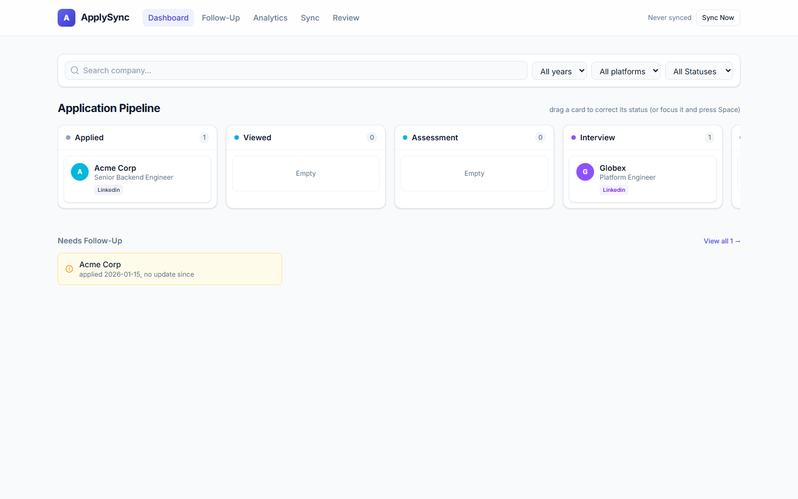
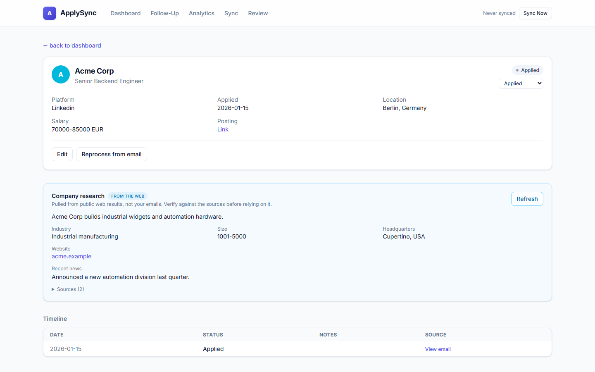
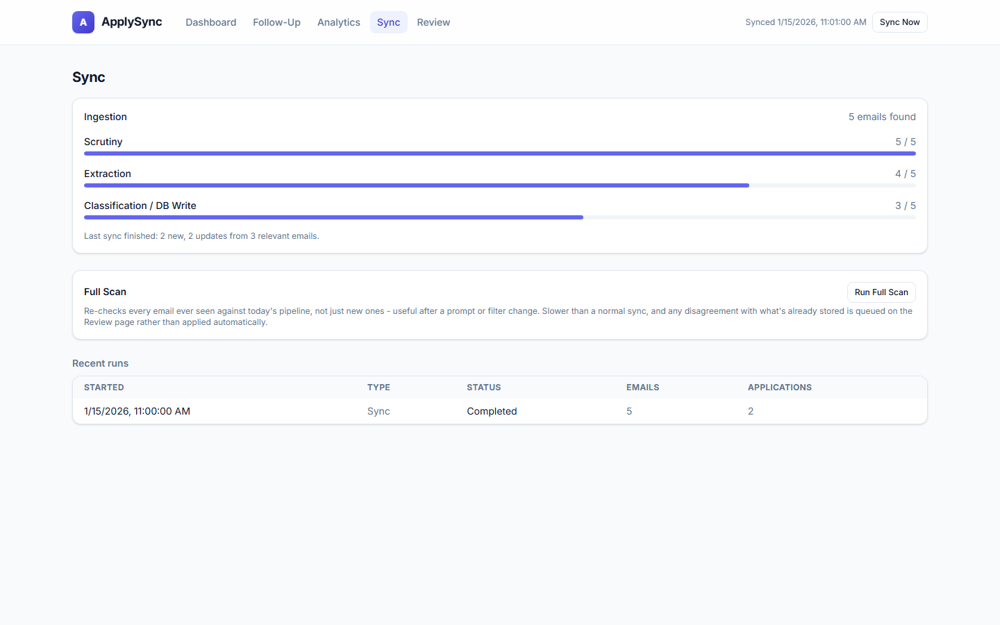
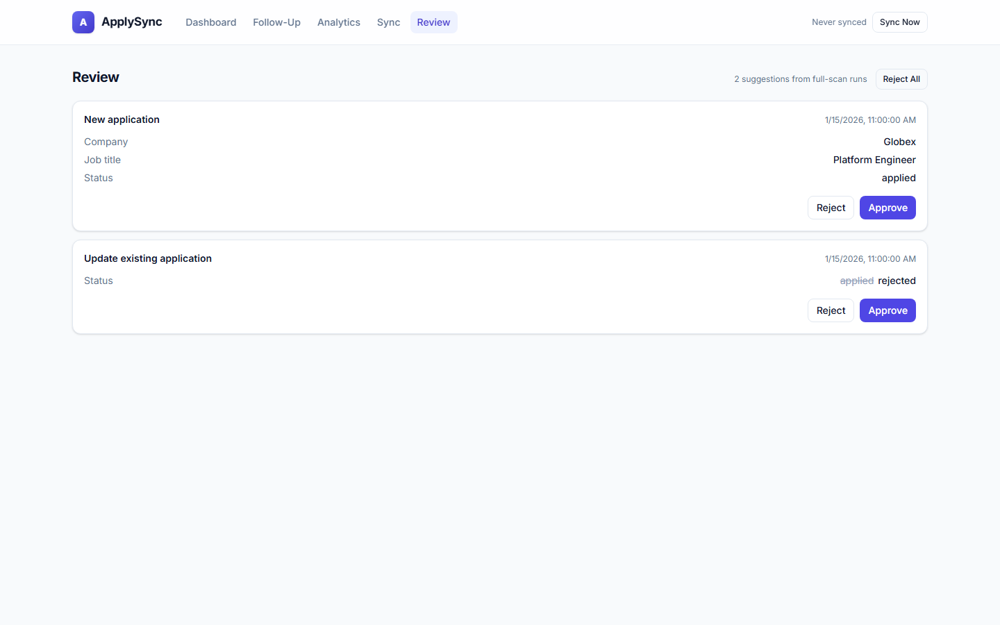
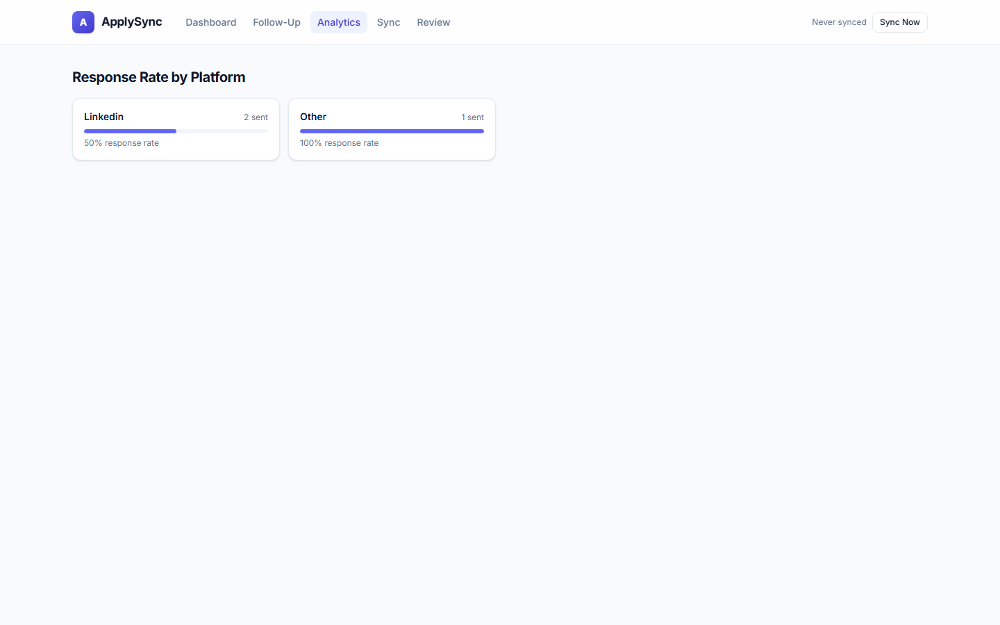
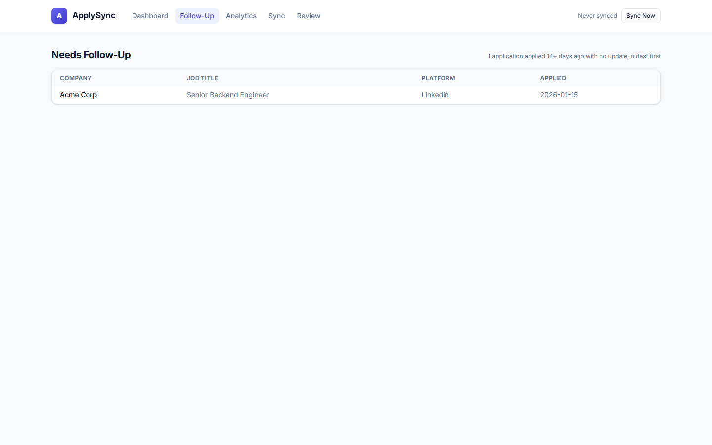
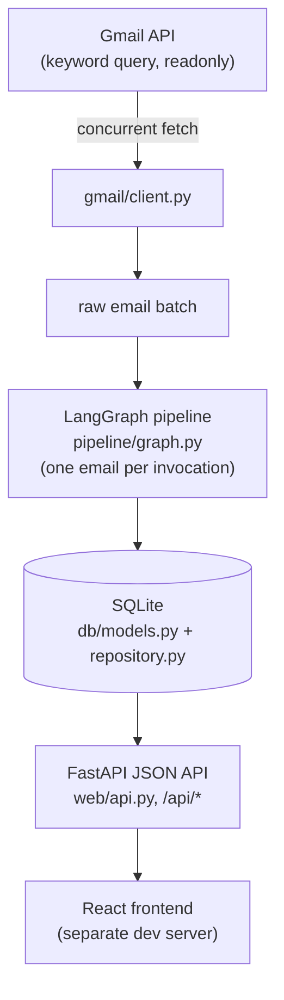
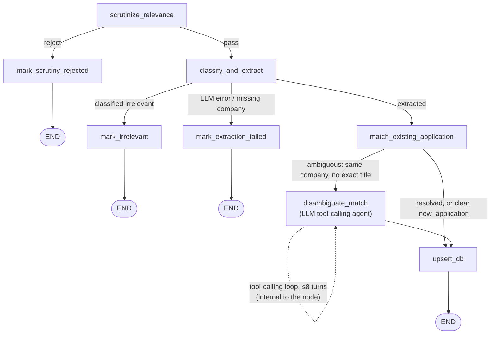

# ApplySync

An email-driven job application tracker that pulls your applications out of your inbox and into one place, no matter which platform or company you applied through.

## Table of Contents

- [Motivation](#motivation)
- [Tech Stack](#tech-stack)
- [Features](#features)
- [Screenshots](#screenshots)
- [Architecture](#architecture)
- [Data Flow](#data-flow)
- [Setup](#setup)
- [LLMOps](#llmops)
- [Roadmap](#roadmap)
- [Contributing](#contributing)
- [License](#license)
- [Acknowledgments](#acknowledgments)

Deeper detail lives alongside the code: pipeline branching internals in
[`docs/pipeline-internals.md`](docs/pipeline-internals.md), the AI-engineering
scorecard in [`docs/llmops-scorecard.md`](docs/llmops-scorecard.md), one-off
experiments in [`docs/experiments/`](docs/experiments/), and full milestone
history in `CLAUDE.md`.

## Motivation

Job hunting across LinkedIn, Indeed, StepStone, direct company career pages, and whatever new AI recruiting tool shows up this month means your application history ends up scattered across a dozen inboxes and a pile of manually named folders. There is no single place that answers a simple question: which companies have I actually applied to, and what happened next? ApplySync starts from an observation: almost every application you submit generates a confirmation or status email somewhere, whether from LinkedIn, an ATS vendor like SmartRecruiters or Personio, or the company itself. Instead of building a scraper for every platform (a losing battle the moment any of them changes their HTML), ApplySync reads those emails directly and uses an LLM to pull out the structured facts: company, role, status, platform. New platforms and ATS vendors need a config change, not new code. On top of that extraction pipeline, ApplySync layers self-hosted, keyless web-research capabilities (company research, follow-up drafting, entity resolution) that turn it from a passive inbox reader into an active research assistant for your job search. The author uses it every day to track a real one.

## Tech Stack

- **Language**: Python 3.11+
- **LLM orchestration**: [LangChain](https://www.langchain.com/) and [LangGraph](https://www.langchain.com/langgraph) - structured-output extraction, a stateful per-email graph with conditional routing, SQLite checkpointing, and a hand-rolled tool-calling agent loop for entity/duplicate resolution
- **LLM provider**: [NVIDIA NIM](https://build.nvidia.com/) via `langchain-nvidia-ai-endpoints`, a fast model (`nvidia/nemotron-3-nano-30b-a3b`, reasoning disabled for speed) for the vast majority of calls, tiered up to a larger escalation model for rare ambiguous cases and the low-volume disambiguation agent, all sharing one process-wide client-side rate limiter matched to the free tier's 40 requests/minute cap. The disambiguation agent can optionally be pointed at [Groq](https://groq.com/) via `langchain-groq` (its own account and rate budget, much lower latency) with automatic fallback to the NVIDIA escalation model, so the agent's multi-turn tool loop stops competing with bulk extraction for one shared budget
- **Email ingestion**: Gmail API (readonly scope only) via `google-api-python-client`, concurrent per-message fetch via a thread pool
- **Persistence**: SQLite via [SQLModel](https://sqlmodel.tiangolo.com/); fuzzy company-name matching via [rapidfuzz](https://github.com/rapidfuzz/RapidFuzz)
- **API**: [FastAPI](https://fastapi.tiangolo.com/), explicit Pydantic response models (real, useful `/docs` Swagger UI)
- **Frontend**: React (Vite + TypeScript) + Tailwind + Framer Motion + `@dnd-kit`, a separate dev server calling the FastAPI JSON API
- **Scheduler**: none yet in-process - see [Roadmap](#roadmap)
- **Observability**: self-hosted [Langfuse](https://langfuse.com/) (Postgres/ClickHouse/Redis/MinIO via docker-compose, NOT a hosted SaaS - email content never leaves the machine) traces every pipeline node and agent tool loop; a hand-labeled eval harness with per-stage accuracy metrics gates prompt/model changes before they ship

## Features

What is actually working today:

- **Gmail ingestion** over a readonly OAuth flow (never write/send scopes), via CLI first-run consent or a dashboard "Connect Gmail" button.
- **Platform-agnostic, keyword-driven search**: emails are found by subject/keyword (`backend/config/sources.yaml`), not a sender allowlist, so unknown ATS vendors and direct company emails still get picked up.
- **Concurrent Gmail fetch** via a worker thread pool.
- **A LangGraph extraction pipeline**, one email per graph invocation: a heuristic + cheap-LLM `scrutinize_relevance` filter, a merged `classify_and_extract` call (company, title, status, location, salary, URL), heuristic + fuzzy `match_existing_application`, an LLM tool-calling `disambiguate_match` agent for the ambiguous same-company case, and deterministic `upsert_db` persistence. See [Architecture](#architecture) and [`docs/pipeline-internals.md`](docs/pipeline-internals.md).
- **Idempotent processing**: every email is tracked by Gmail message id so re-runs never duplicate work; per-run progress is persisted incrementally as it happens.
- **Full application-lifecycle status tracking**: applied, viewed, assessment, interview, rejected, offer, declined (manual-only), and other.
- **A React dashboard**: Kanban status board with keyboard-operable drag-and-drop status correction, inline editing, "reprocess from source email", per-application timelines with the source email viewable inline, follow-up reminders, and a per-platform response-rate breakdown, all over a FastAPI JSON API with a full OpenAPI schema.
- **Manual "Sync Now"** and a `/sync` page with staged progress, a live pipeline-flow graph animated node-by-node (SSE, diagnostic only), a Stop button, and run history, plus the `applysync sync` CLI.
- **Full Audit**: re-runs today's extraction over every email ever seen to catch prompt/model drift; never writes directly, every disagreement becomes a reviewable suggestion on `/review`.
- **Best-effort platform attribution** for dashboard labeling (LinkedIn, Indeed, StepStone, SmartRecruiters, Personio, Ashby, and more), configured in `backend/config/sources.yaml`.
- **Company research card**: on-demand grounded company profile (summary, industry, size, HQ, website, recent news) from live web results via self-hosted SearXNG, clearly labeled web-sourced and kept strictly separate from email-extracted data, with source links and per-company caching.
- **Reliability tooling**: a hand-labeled eval harness with per-stage accuracy metrics that gates prompt/model changes, plus self-hosted Langfuse tracing with a flagged-trace-to-eval-sample feedback loop. See [LLMOps](#llmops).
- **Playwright end-to-end tests** with an `@axe-core/playwright` accessibility check on every page.

Not built yet, see [Roadmap](#roadmap): automatic/scheduled syncing and confidence-routed merge review.

## Screenshots

Rendered from the Playwright end-to-end suite's mocked fixtures, so they use
example data ("Acme Corp", "Globex"), not a real inbox. Regenerate with
`SCREENSHOTS=1 npx playwright test screenshots.spec.ts` in `frontend/`.

**Application pipeline** - a Kanban board grouped by status, with drag-and-drop status correction and a follow-up reminders preview:



**Application detail with company research** - the web-research card is clearly labeled as web-sourced and kept separate from the email-extracted fields above it, with source links for verification:



**Sync** - a live pipeline-flow graph animated node-by-node as the run progresses, a staged progress view (ingestion, scrutiny, extraction, classification/DB write), a Stop button, a recent-run history, and the Full Audit control:



**Review** - Full Audit runs never overwrite data; they queue suggestions here for approval, with a before/after diff for status changes:



**Analytics** - response rate per platform:



**Follow-Up** - applications with no update in 14+ days, oldest first:



## Architecture

Ingestion feeds a per-email LangGraph pipeline, which persists to SQLite behind a
FastAPI JSON API that the React dashboard renders:


```mermaid
flowchart TD
    Gmail["Gmail API<br/>(keyword query, readonly)"] -->|concurrent fetch| Client["gmail/client.py"]
    Client --> Batch["raw email batch"]
    Batch --> Pipeline["LangGraph pipeline<br/>pipeline/graph.py<br/>(one email per invocation)"]
    Pipeline --> DB[("SQLite<br/>db/models.py + repository.py")]
    DB --> API["FastAPI JSON API<br/>web/api.py, /api/*"]
    API --> UI["React frontend<br/>(separate dev server)"]
```

A sync is triggered manually (`POST /api/sync` runs the pipeline once on a
background thread, or the `applysync sync` CLI); scheduled syncing is
[not yet built](#roadmap). Self-hosted Langfuse (`langfuse/`) optionally traces
every node and agent tool loop of a sync; it is diagnostic only, never
load-bearing. `fetch_emails` is a plain batch fetch, not a graph node: the graph
runs on one email at a time, driven by a loop in `process_emails`.

Inside the graph, conditional edges route each email to `upsert_db` or to one of
three short-circuit `mark_*` terminal nodes (marked processed, no rows written)
so a skipped email is recorded once and never retried:


```mermaid
flowchart TD
    S["scrutinize_relevance"] -->|reject| MSR["mark_scrutiny_rejected"] --> E1(["END"])
    S -->|pass| CE["classify_and_extract"]
    CE -->|classified irrelevant| MI["mark_irrelevant"] --> E2(["END"])
    CE -->|LLM error / missing company| MEF["mark_extraction_failed"] --> E3(["END"])
    CE -->|extracted| M["match_existing_application"]
    M -->|ambiguous: same company, no exact title| D["disambiguate_match<br/>(LLM tool-calling agent)"]
    M -->|resolved, or clear new_application| U["upsert_db"]
    D -. "tool-calling loop, &le;8 turns<br/>(internal to the node)" .-> D
    D --> U
    U --> E4(["END"])
```

Every graph-level branch is deterministic Python reading a state field; no LLM
chooses the next node. The one agentic exception is `disambiguate_match`: the
dotted self-loop is *inside* the node (the LangGraph graph itself has no cycle) -
a hand-rolled ReAct loop where the LLM repeatedly picks a tool (status history,
source email, web identity check), reads the result, and loops until it submits a
verdict or hits the 8-turn cap, failing open to a new row on any error. The exact
per-edge conditions, that internal loop, the skip-node factory, and the
workflow-vs-agent rationale are documented in
[`docs/pipeline-internals.md`](docs/pipeline-internals.md).

## Data Flow

Following one email through the system, function by function:

1. `run_sync` (`pipeline/graph.py`) builds a Gmail query from `sources.yaml`'s keywords (bounded by the last run's date plus a lookback buffer) and calls `GmailClient.fetch_messages` to pull the raw batch concurrently.
2. `process_emails` drops anything already in the `processed_emails` table (idempotency guard), then streams each remaining email through the compiled LangGraph.
3. `scrutinize_relevance` (`pipeline/nodes.py`) runs a heuristic first, escalating to one cheap `RelevanceOnlyResult` LLM call only when ambiguous; a reject short-circuits to `mark_scrutiny_rejected`.
4. `classify_and_extract` makes one structured-output call (`ClassifyAndExtractResult`) that classifies relevance and extracts `company_name`, `job_title`, `status`, `job_url`, `location`, and `salary_text` in a single round trip.
5. `match_existing_application` normalizes company/title and looks for an existing `Application` with the same company/title/platform: exact hit resolves immediately, no company match is `new_application`, a company match with no exact title match is the ambiguous case.
6. For the ambiguous case, `disambiguate_match` (`research/disambiguate.py`) runs an LLM tool-calling loop over the candidates and submits a verdict, failing open to `new_application` on any error or missing dependency.
7. `upsert_db` writes a new `Application` or a new `StatusEvent`, always finishing with `mark_processed`.
8. The FastAPI layer (`web/api.py`) exposes the result at `/api/dashboard`, `/api/applications/{id}`, `/api/reminders`, etc.; the React dashboard renders those and writes corrections back through the same API.

## Setup

### Prerequisites

- Python 3.11 or newer, and Node.js (for the frontend) if you want the dashboard UI
- A Gmail account you apply for jobs from
- A Google Cloud project with the Gmail API enabled and OAuth credentials
- A free [NVIDIA API key](https://build.nvidia.com/) for the LLM calls
- (Optional) Docker, only if you want the self-hosted web-search layer (see [Web search](#web-search-optional) below) powering the research features, and/or self-hosted [observability](#observability-optional) tracing

### Installation

Clone the repository:

```
git clone https://github.com/hanzala-bhutto/ApplySync.git
cd ApplySync
```

Create a virtual environment and install the backend:

```
python -m venv .venv
.venv\Scripts\activate      # Windows
source .venv/bin/activate   # macOS / Linux
pip install -e ".[dev]"
```

Copy the environment template and fill it in:

```
cp .env.example .env
```

At minimum, set `NVIDIA_API_KEY` in `.env`. Optionally, set both `GROQ_API_KEY` and `GROQ_AGENT_MODEL` to run the disambiguation agent on Groq (with automatic NVIDIA fallback); leave them blank and the agent runs on the NVIDIA escalation model exactly as before.

Complete the one-time Gmail OAuth setup (Google Cloud project, consent screen, `credentials.json`) using the walkthrough in `.claude/skills/gmail-setup/SKILL.md`, then place `credentials.json` at the path `.env` points to - or skip this entirely and use the dashboard's "Connect Gmail" button instead, which walks through the same consent flow in the browser.

If you want the dashboard UI, install the frontend separately:

```
cd frontend
npm install
```

### Web search (optional)

The company-research features (research card, follow-up drafting, entity resolution, and more - see [Roadmap](#roadmap)) get live web results from a self-hosted [SearXNG](https://github.com/searxng/searxng) instance. It is deliberately self-hosted and keyless: no external account, no paid API, no third party seeing your queries, matching this project's local-first design. Everything else works without it; only the research features need it.

Start it in its own terminal (Docker must be running):

```
cd searxng
docker compose up -d
```

That brings up SearXNG on `http://localhost:8888` (the default `SEARXNG_URL` in `.env`). Verify it end to end:

```
applysync search "egym careers"
```

The bundled `searxng/settings.yml` enables SearXNG's JSON API and disables the bot-detection limiter (so no Redis sidecar is needed) - both required for programmatic access from a single-user local tool. It ships with a generated `secret_key`; that key only signs this local instance's own sessions and is not a credential to anything external, but you can regenerate it (the file says how) if you prefer.

### Observability (optional)

Per-node, per-call tracing of a real sync - every LangGraph node, every LLM call, and the disambiguation agent's whole tool loop - runs on self-hosted [Langfuse](https://langfuse.com/) (Postgres, ClickHouse, Redis, MinIO via docker-compose), not a hosted SaaS: email content never leaves the machine. Everything else works without it; a sync just runs untraced.

Start it in its own terminal (Docker must be running):

```
cd langfuse
docker compose up -d
```

First run: open `http://localhost:3000`, sign up (a local-only account), create a project, and put its API keys into the project's root `.env` (`LANGFUSE_PUBLIC_KEY`/`LANGFUSE_SECRET_KEY`/`LANGFUSE_HOST`) - see `langfuse/.env.example` for what else to generate. Once set, `applysync sync` traces automatically; tracing is diagnostic only; a missing/misconfigured Langfuse instance never blocks or changes a sync's behavior.

### Usage

Run one pass of the ingestion and extraction pipeline from the CLI:

```
applysync sync
```

Or run the API server and trigger syncs from the dashboard's "Sync Now" button / `/sync` page instead:

```
applysync serve
```

Run the frontend in its own terminal (separate dev server, by design):

```
cd frontend
npm run dev
```

Both `applysync sync` and a dashboard-triggered sync fetch new application-related emails from Gmail, run them through the LangGraph pipeline, and persist the results to a local SQLite database (`applysync.db` by default).

## LLMOps

A prompt or model change is a production deploy: output is probabilistic, correctness is a percentage rather than a boolean, and the model can drift under you. This project treats that seriously while staying zero-vendor and zero-egress: everything runs self-hosted, and no email content, database, or gold dataset ever leaves the machine. Because the gold eval dataset holds real email bodies (PII, gitignored) and hits the live rate-limited model, the checks split across **two planes** so only the pass/fail decision leaves the machine:

| Check | Runs where | Touches PII / live model? | How to run |
| --- | --- | --- | --- |
| Unit tests, lint, frontend build + Playwright E2E | GitHub Actions (cloud) | No (LLM mocked, `/api/*` mocked) | automatic on every PR (`.github/workflows/ci.yml`) |
| Prompt/schema-drift guard (locks the classifier's status space) | GitHub Actions (cloud) | No | `pytest tests/test_schema_drift.py` |
| Eval gate (per-stage accuracy vs thresholds) | Local | Yes | `python eval/run_eval.py --strict` |
| Pre-push enforcement of the eval gate | Local git hook | Yes | `sh scripts/install-hooks.sh` (once), then blocks a regressing push; bypass with `git push --no-verify` |
| Quality-over-time ledger | Local, committed | No (aggregate numbers only) | `python eval/run_eval.py --strict --ledger` appends to `eval/baseline.json` |
| Production feedback loop (score traces, pull failures into gold) | Local + self-hosted Langfuse | Yes | `backend/scripts/run_llm_judge_backfill.py`, `backend/scripts/pull_flagged_traces.py` |

`eval/baseline.json` is the one eval artifact allowed on the public repo, and it is aggregate-only (dates, git SHA, model name, accuracy percentages), never a message ID, email body, or company name. A competency scorecard rating what this project exercises as an AI-engineering discipline, with the concrete in-repo evidence, lives in [`docs/llmops-scorecard.md`](docs/llmops-scorecard.md).

## Roadmap

- [x] Gmail OAuth client (CLI first-run and in-dashboard web flow), keyword-based query builder, concurrent message fetch
- [x] LangGraph pipeline: scrutiny, classify+extract, match, upsert, with SQLite persistence, idempotency, and incremental progress tracking
- [x] React dashboard: status board with drag-and-drop, per-application timeline with source-email verification, inline editing, reprocess action, follow-up reminders, per-platform analytics, and a staged sync-progress page
- [x] Pipeline redesign (broadened keyword coverage, a scrutiny node ahead of extraction, and staged sync progress), verified against a real full-history resync
- [ ] Scheduler: automatic periodic syncing independent of whether the dashboard/server is running (planned as an OS-level scheduled task, not an in-process one)
- [x] Self-hosted, keyless web-search layer (SearXNG) as the foundation for the research features below
- [x] Company research card (first web-research feature): grounded, cached, source-linked company profiles on the detail page
- [x] Entity/duplicate resolution: an LLM tool-calling agent decides same-application/different-application/duplicate for ambiguous matches, gated on it actually gathering evidence before it's allowed to merge
- [x] Fuzzy/alias company matching: typo- and word-add-tolerant company comparison feeding the disambiguation agent, so near-identical company names no longer silently create duplicate rows
- [ ] More web-research features on top of the same layer: follow-up "should I chase this + warm draft", company-alias canonicalization, and an interview-prep dossier
- [x] Eval harness: a hand-labeled gold dataset with per-stage accuracy metrics (scrutiny, classification, extraction), gating prompt/model changes before they ship
- [x] Tiered escalation model: a larger model handles rare ambiguous scrutiny/extraction calls and the low-volume disambiguation agent, verified against the eval baseline
- [x] Cross-provider disambiguation agent: the agent optionally runs on Groq (its own rate budget, lower latency) with automatic NVIDIA fallback, plus a deterministic shared-requisition-ID short-circuit that resolves exact same-posting matches before any model runs
- [x] Self-hosted Langfuse observability: traces every node and agent tool loop of a real sync, with a flagged-trace-to-eval-sample feedback loop
- [x] Granular per-stage Langfuse score configs + LLM-as-judge evaluators, run for the first time against a real full-history sync: caught and fixed a real disambiguation-agent bug (date-chronology reasoning errors) this way
- [x] Real-time pipeline flow visualization: a live graph on the Sync page mirroring the actual LangGraph structure, animated node-by-node via SSE as a real sync runs; a Stop button for cancelling an in-progress sync
- [ ] Confidence-routed merges: agent verdicts below a confidence bar become review suggestions instead of applying silently

Full milestone detail, including the reasoning behind each decision, lives in `CLAUDE.md`. One-off experiments that never shipped (e.g. running the pipeline on a local 8GB-VRAM Ollama model) are written up in [`docs/experiments/`](docs/experiments/).

## Contributing

This is a personal, self-hosted tool, but issues and pull requests are welcome. If you are adding support for a new job platform or ATS vendor, it almost certainly belongs in `backend/config/sources.yaml`, not as new parsing code - that separation is a deliberate design constraint, see `CLAUDE.md` for why.

## License

Released under the [MIT License](LICENSE).

## Acknowledgments

- [NVIDIA](https://build.nvidia.com/) for free access to the Nemotron model family used for extraction
- The [LangChain and LangGraph](https://www.langchain.com/) teams and community
- Built with the help of [Claude Code](https://claude.com/claude-code) as a pair-programming partner throughout
