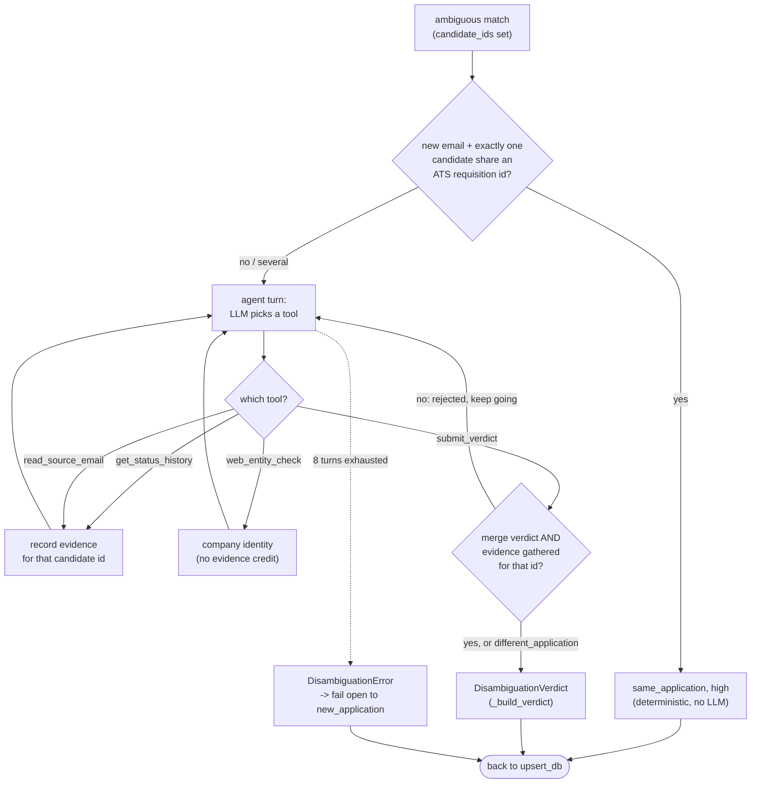

# Pipeline internals: the LangGraph decision-making detail

The README's Architecture and LangGraph Decision Making sections show the graph
shape. This file holds the deeper per-edge detail: exactly which state field
each conditional edge reads, where each branch terminates, and why the design is
a deterministic workflow with one narrow agentic exception. It tracks
`pipeline/graph.py::build_graph` and `pipeline/nodes.py`.

## What each conditional edge actually checks

- **`scrutinize_relevance` -> `scrutiny`** (`"pass"` / `"reject"`): a pure
  heuristic (subject/body string matching against known digest markers and
  confirmation phrases) resolves most emails with zero LLM calls; only a
  genuinely ambiguous subject triggers one `RelevanceOnlyResult` LLM call,
  escalated to the larger model.
- **`classify_and_extract` -> `_route()`** on `extracted` and `classification`:
  `extracted is not None` routes to matching; `extracted is None` splits again on
  whether the model classified the email as `"irrelevant"` versus a genuine
  failure (LLM error, or missing `company_name` - the latter gets one
  escalation-model retry before failing).
- **`match_existing_application` -> `_route_match()`** on `match`/`candidate_ids`:
  an exact company+title hit resolves immediately (`match` set, straight to
  `upsert_db`); no company match at all is a clear `new_application`; a company
  match (exact *or* fuzzy) with no exact title match leaves `match` unset and
  `candidate_ids` populated, routing to `disambiguate_match` when the agent's
  dependencies (`gmail_client`/`search_client`) are wired in, or falling open to
  `new_application` when they aren't (unit tests, a degraded run).

## The skip nodes and the in-node branch

All three `mark_*` nodes (`mark_scrutiny_rejected`, `mark_irrelevant`,
`mark_extraction_failed`) are the same `make_skip_node` factory, parameterized
only by the `classification` string they record - each just calls
`repo.mark_processed` and writes no `Application`/`StatusEvent` rows, so a
skipped email is recorded once and never retried, while the reason it was
skipped is preserved for later inspection.

`match_existing_application`'s `MatchDecision.action` (`new_application` vs.
`update_existing` vs. `duplicate_skip`) branches *inside* `upsert_db` rather than
as a graph-level conditional edge - deciding whether to insert a new
`Application`, append a `StatusEvent` to an existing one, or write nothing, but
not changing which node runs next.

`full_audit.py` (used by the dashboard's "Full Audit" review flow, renamed from
`full_scan.py` since it never writes directly) reuses `scrutinize_relevance` and
`classify_and_extract` as plain Python functions with its own manual branching to
produce `ReviewSuggestion` rows for human approval - it does not build or run a
`StateGraph`, so it isn't part of the graph diagram.

## Mostly a workflow, with one narrow agentic exception

Every *graph-level* branch is a plain Python conditional reading a state field
(`scrutiny`, or `_route()`/`_route_match()` on `extracted`/`classification`/
`match`) - no LLM decides which node runs next, and the routing itself is
deterministic code. That is a deliberate fit for the well-known outcomes
(relevant/irrelevant, new/update/duplicate), where a fixed graph is easier to
test and reason about than an agent would be.

The one deliberate exception is `disambiguate_match`: for the genuinely
ambiguous case (same company, no exact title match), an LLM tool-calling agent -
not a fixed sequence of steps - chooses which evidence to gather (status history,
source email, a web identity check) and loops until it's ready to submit a
verdict. This is a narrow, contained use of agentic behavior exactly where the
outcome genuinely can't be predicted in advance, with a hard safety rail: a merge
verdict is rejected outright unless the agent actually gathered evidence for that
specific candidate first, and any agent failure fails open to a new (recoverable)
row rather than a silent wrong merge. The company research card (and further
research features on the Roadmap) are the other place this project uses genuinely
agentic, tool-choosing behavior, outside the graph entirely.

## Inside `disambiguate_match`: the agentic loop

The pipeline diagram shows `disambiguate_match` as a single node, because in
LangGraph terms it *is* one node with a straight edge to `upsert_db` - the graph
has no cycle. The looping is a hand-rolled ReAct loop **inside** the node
(`research/disambiguate.py::run_disambiguation`, the
`for _ in range(MAX_AGENT_TURNS)` loop, `MAX_AGENT_TURNS = 8`). Each turn the
model picks a tool, the result is appended to the message history, and it loops
until it calls `submit_verdict` or exhausts its turns:

The four tools are `@tool`-decorated closures in `run_disambiguation`:
`get_status_history` and `read_source_email` are the evidence tools (each adds the
candidate id to `evidence_gathered`), `web_entity_check` only confirms a company's
real-world identity and does *not* count as evidence for a merge, and
`submit_verdict` is the terminal tool. The evidence gate lives in
`submit_verdict` itself: a `same_application`/`duplicate` verdict whose
`matched_application_id` is not in `evidence_gathered` is rejected with a message
telling the model to gather evidence first, so the loop continues instead of
merging on a guess. `different_application` has no such requirement. A verdict
below the confidence bar is routed to human review rather than applied silently,
and any unrecoverable failure (bad tool args the model can't correct, a
hallucinated id, or never submitting within 8 turns) raises `DisambiguationError`,
which the node catches and fails open to `new_application`.
